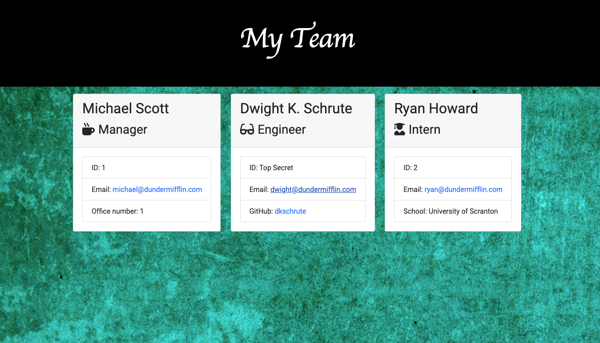

# An Employee Information Template Engine

## Description

This was a homework assignment to meet the requirements of GA Tech's Full Stack Web Development Program. We were asked to build a Node CLI for managers that takes in information about employees and generates an HTML webpage that displays summaries for each person. We utilized html, css, javascript, and node to build the app.

## Table of Contents

* [Installation](#installation)
* [Usage](#usage)
* [Contributing](#contributing)
* [License](#license)

## Installation

First, fork the repo. Then, open the application in your code editor. Navigate to the Develop folder, then run npm install. 

## Usage

After the program has been installed, type 'node app.js' in your terminal. Answer the prompts, and enjoy your reasily generated Team Template!

## License

Copyright 2020 Elizabeth Regas

Permission is hereby granted, free of charge, to any person obtaining a copy of this software and associated documentation files (the "Software"), to deal in the Software without restriction, including without limitation the rights to use, copy, modify, merge, publish, distribute, sublicense, and/or sell copies of the Software, and to permit persons to whom the Software is furnished to do so, subject to the following conditions:

The above copyright notice and this permission notice shall be included in all copies or substantial portions of the Software.

THE SOFTWARE IS PROVIDED "AS IS", WITHOUT WARRANTY OF ANY KIND, EXPRESS OR IMPLIED, INCLUDING BUT NOT LIMITED TO THE WARRANTIES OF MERCHANTABILITY, FITNESS FOR A PARTICULAR PURPOSE AND NONINFRINGEMENT. IN NO EVENT SHALL THE AUTHORS OR COPYRIGHT HOLDERS BE LIABLE FOR ANY CLAIM, DAMAGES OR OTHER LIABILITY, WHETHER IN AN ACTION OF CONTRACT, TORT OR OTHERWISE, ARISING FROM, OUT OF OR IN CONNECTION WITH THE SOFTWARE OR THE USE OR OTHER DEALINGS IN THE SOFTWARE.

## Contributing

Contact the creator (for email and Github, see below) for information on contribution.

## Tests

All testing requirements can be found in the 'test' folder. Additional vslidation was built into the inquirer questions via 'validate'.

## Questions

Github Profile for Elizabeth Regas:
https://github.com/ElizaRegas

Feel free to contact me with any questions:
elizaregas@gmail.com

